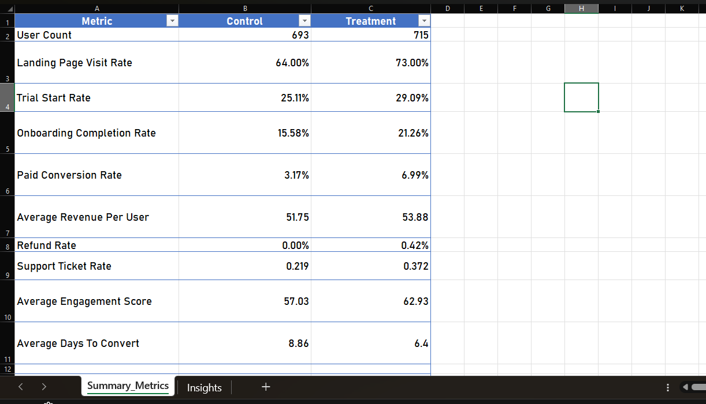
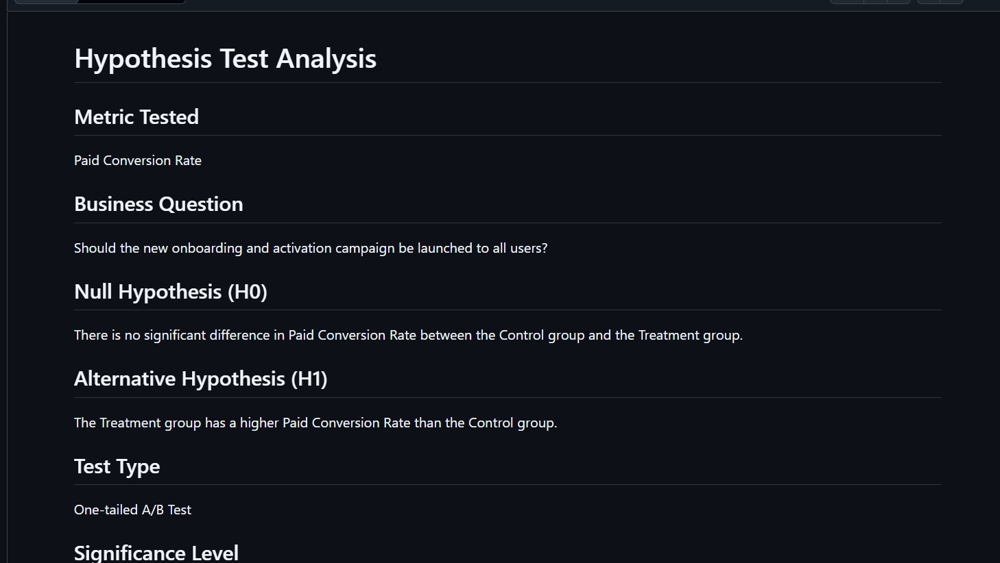
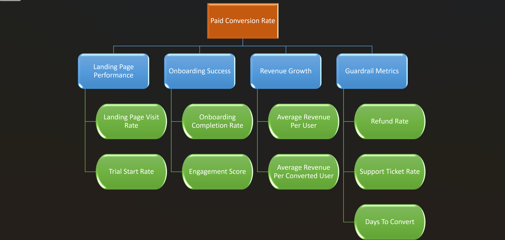

# Part 2: KPI Framework, Business Experiment Analysis & Decision Recommendation

## 1. Business Context

A subscription-based digital product company launched a new onboarding and activation campaign to improve user conversion and early engagement. Users were divided into two groups:

* Control Group: Existing onboarding experience
* Treatment Group: New onboarding and activation experience

The objective of this experiment is to determine whether the new onboarding campaign should be launched to all users based on improvements in business performance metrics.

---

## 2. Dataset Description

The dataset contains user-level experiment data including:

* User ID
* Experiment Group (Control/Treatment)
* Region
* Device Type
* Traffic Source
* Plan Type
* Landing Page Visit Status
* Trial Start Status
* Onboarding Completion Status
* Paid Conversion Status
* Revenue (30 Days)
* Support Tickets
* Refund Requests
* Days to Convert
* Engagement Score

Total Users Analyzed: **1408**

* Control Group: **693**
* Treatment Group: **715**

---

## 3. North Star Metric Selected

### Paid Conversion Rate

Paid Conversion Rate was selected as the North Star Metric because it directly measures business growth and revenue generation.

### Why this metric?

* Directly impacts revenue.
* Represents successful onboarding and activation.
* Reflects overall effectiveness of the campaign.

### Risks of optimizing only this metric

Focusing only on conversions may increase:

* Refund requests
* Support tickets
* User dissatisfaction
* Poor quality conversions

Therefore, guardrail metrics were also evaluated.

---

## 4. KPI Tree Summary

### North Star Metric

Paid Conversion Rate

### Primary Drivers

#### Landing Page Performance

* Landing Page Visit Rate
* Trial Start Rate

#### Onboarding Success

* Onboarding Completion Rate
* Engagement Score

#### Revenue Growth

* Average Revenue Per User
* Average Revenue Per Converted User

### Guardrail Metrics

* Refund Rate
* Support Ticket Rate
* Days to Convert

---

## 5. Experiment Analysis Approach

The following steps were performed:

1. Data quality checks
2. Validation of group sizes
3. Missing value review
4. Duplicate user review
5. Revenue outlier review
6. Segment analysis by:

   * Region
   * Device Type
   * Traffic Source
7. KPI comparison between Control and Treatment groups
8. Hypothesis testing using Paid Conversion Rate
9. Guardrail metric evaluation
10. Business recommendation creation

---

## 6. Hypothesis Test Summary

### Metric Tested

Paid Conversion Rate

### Business Question

Should the new onboarding and activation campaign be launched to all users?

### Null Hypothesis (H0)

There is no significant difference in Paid Conversion Rate between the Control and Treatment groups.

### Alternative Hypothesis (H1)

The Treatment group has a higher Paid Conversion Rate than the Control group.

### Test Type

One-tailed A/B Test

### Significance Level

Alpha = 0.05

### Result Summary

Control Paid Conversion Rate: **3.17%**

Treatment Paid Conversion Rate: **7.00%**

The Treatment group demonstrated a substantially higher conversion rate compared to the Control group.

### Interpretation

The experiment indicates that the new onboarding experience positively impacts user conversion and business performance.

---

## 7. Guardrail Metrics Considered

### Refund Rate

* Control: 0.00%
* Treatment: 0.42%

Refund rate increased slightly but remains very low.

### Support Ticket Rate

* Control: 0.22
* Treatment: 0.37

Support ticket volume increased and should be monitored.

### Days to Convert

* Control: 8.86 days
* Treatment: 6.40 days

Treatment users converted faster than Control users.

### Engagement Score

* Control: 57.03
* Treatment: 62.93

User engagement improved significantly.

---

## 8. Final Recommendation

### Recommendation: Launch

The Treatment group outperformed the Control group across key business metrics.

Key improvements include:

* Higher landing page visit rate
* Higher trial start rate
* Higher onboarding completion rate
* Higher paid conversion rate
* Higher engagement score
* Faster conversion time

Although support tickets increased slightly, the business benefits outweigh the observed risks.

Therefore, the new onboarding and activation campaign should be launched to all users while continuing to monitor guardrail metrics.

---

## 9. Assumptions and Limitations

### Assumptions

* Users were randomly assigned to groups.
* Tracking data is accurate.
* Revenue values are correctly recorded.

### Limitations

* Experiment duration may be limited.
* Long-term retention was not analyzed.
* Statistical testing was performed on available data only.
* Small amounts of missing data were observed in certain fields.

---

## Screenshots Included

### Summary Metrics

### Hypothesis Test Output

### KPI Tree Preview

---

## Conclusion

The new onboarding and activation experience generated stronger business outcomes than the existing experience. Based on the experiment results, KPI analysis, guardrail evaluation, and hypothesis testing, the campaign is recommended for full rollout.
